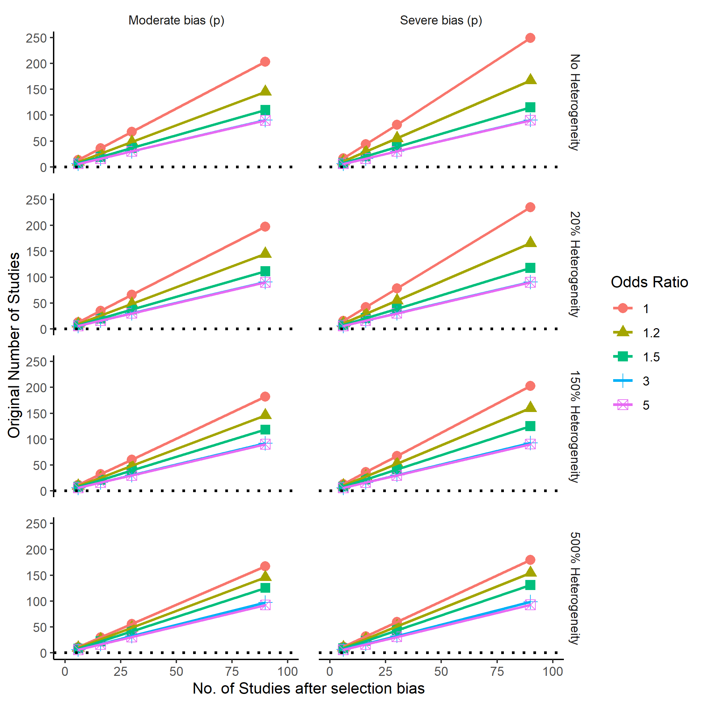
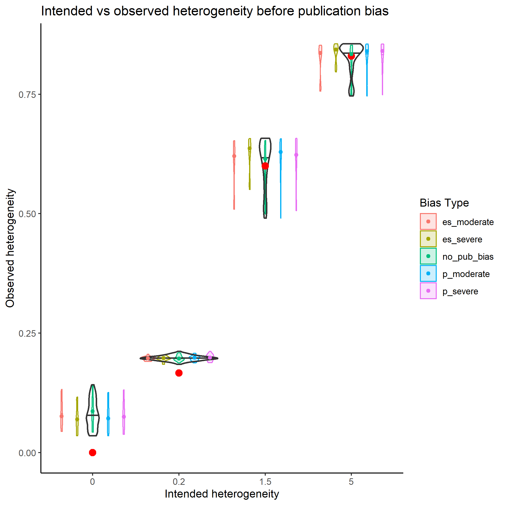

<!-- This is the format for text comments that will be ignored during renderings. Do not put R code in these comments because it will not be ignored. -->

```{r setup, include = FALSE}
library("papaja")
r_refs("r-references.bib")

knitr::opts_chunk$set(
  collapse = TRUE,
  warning = FALSE,
  message = FALSE,
  echo = FALSE,
  comment = "#>",
  fig.path = "../figures/",
  dpi = 300
)
```

```{r analysis-preferences}
# Seed for random number generation
set.seed(42)
knitr::opts_chunk$set(cache.extra = knitr::rand_seed)
```

# Introduction

This replication report documents the replication attempt of the simulation study Peters, J. L., Sutton, A. J., Jones, D. R., Abrams, K. R., & Rushton, L. (2006). Comparison of Two Methods to Detect Publication Bias in Meta-analysis. *JAMA*, 295(*6*), 676–678. https://doi.org/10.1001/jama.295.6.676 [@peters_comparison_2006]. 

Section 2 details the sources of information utilized for the present replication attempt. 
Section 3 provides an overview of the information that was extracted from those sources.
Section 4 covers all researcher degrees of freedom, i.e. decisions that had to be made by the replicators because of insufficient or contradicting information in the original sources. 
Section 5 presents descriptive statistics from the data generating mechanism, i.e. the artificial sample. 
Section 6 presents the replicated results.
Section 7 Discusses the replication attempst with reagrds to general replicability, replicator degrees of freedom and equivalence of results.
The appendix contains the README file providing an overview of the accompanying code.

# Method

## Information basis
The information upon which the replication is based stems from two different sources (1) the published manuscript [@peters_comparison_2006] (referred to as *article*) as well as (2) a technical report [@peters_performance_2005]. 
The published article is fairly short and repeatedly refers to details obtainable from a technical report. 
The technical report is listed in the reference section of the published article, however it was not available from the public domain (i.e. online line supplements or a public online repository). 
The technical report was hence requested and obtained by email from the Department of Health Sciences at Leister University (hsenquiries@leicester.ac.uk). <!--Conflicting or insufficient information from there two sources were supplemented with information from referenced articles in either manuscript as well as similar publications on the topic by the same authors.-->
<!-- Add that the author was contacted once we have actually done that  -->

## Data Generating Mechanism

The following table shows an overview of simulation factors.

| Simulation factor | No. levels | Levels|
|------|--|-------|
| *Varied*||                                                         
| Publication bias| 5 | none, effect size based moderate (14%), effect size based severe (40%), p-value based moderate, p-value based severe |  
| True effect size (OR) |5| 1, 1.2, 1.5, 3, 5|
| Between Study Heterogeneity ($I^2$)|4| 0, 20, 150, 500 (0, 16.7%, 60%, 83.3%)|                   
| Number of primary studies in meta-analysis |4 | 6, 16, 30, 90|
| *Fixed* |||
| Sample size control group| |exponential of the normal distribution with a mean of 5 and variance of 0.3 |
| Ratio treatment:control group| |1:1|     
| Probability of event in control group| | sampled from unif(0.3, 0.7)| 

### Publication bias
Five different levels of publication bias were implemented. No publication bias, moderate p-value based publication bias, severe p-value based publication bias, moderate effect-size based publication bias as well as severe effect-size based publication bias.
Details regarding the iplementation of each of these levels was obtained from the technical report (p.15, p. 20). The original article only mentions that funnel plot asymmetry was "[...] induces in 2 ways. First, it was induced on the basis of the { valie associated with a stugy's effect size (the larger the P value the more likely that study was excluded from the meta-analysis).[...] publication bias was also induced on the basis of study effect size with tthe most extreme negative effect sizes were excluded from the meta-analysis."(p.677)}

1. studies are censored as a result of the one-sided p-value associated with the effect estimate of interest
The p-value based selection probability is given in the following table (table 2, report p. 15)

|Severity of publication bias| p-value| Selection Probability|
|:---:|:---:|:---:|
Moderate| <0.05|1|
||0.05 - 0.2| 0.75|
||0.2-0.5|0.5|
||>0.5|0.25|
Severe|<0.05|1|
||0.05-0.2|0.75|
||>0.2|0.25|

2. studies with the most extreme effect estimates of effect are censored 

### True effect
Fixed effects model is given by
$y_i=\theta + \epsilon_i$
where $\theta$ is the true underlying effect lnOR

Random effects model
$y_i = \theta_i + \epsilon_i$
with $\theta_i~ N(\mu,\tau^2)$ 
where $\theta_i$ is the true effect in study $i$
$\mu$ true underlying effect lnOR
$\tau^2$ is the between-study variance

### Between Study Heterogeneity 
Between-study variance is defined to be 20%, 150, and 500% of the average within-study variance for studies from the corresponding simulations.
This compares with specifications of $I^2$, describing the percentage of total variation across studies that is due to between-study heterogeneity rather than chance (ref 25). Here 20%, 150% and 500 % of the within-study variation corresponds to an $I^2$ of 16.7%, 60% and 83% respectively.

### Size of control group
The number of participants in the control group of a given single study is sampled from the exponential of a normal distribution with a mean of 5 and a variance of 0.3 (article p. 677).
The technical report gives $N(5, 0.3)$ as the distribution from which the number of control groups within each primary study is taken (report p.15). As this does not make much sense we interpreted it as a typo and followed the information from the original article.


### Repetitions
Each of the 400 unique scenarios were repeted 1000 times.

### Data generating progress
Figure 1 provides a flow chart with an overview of the data generating process.

{width=590px}

Data generation can be summarized with the following pseudocode:

- `For 1000 repetitions of each of 400 unique scenarios:`
- `Set unique seed based on scenario id and number of repetition.`
- `Simulate an unbiased study set based on the control group event probability.`
  * `While number of selected studies < number of required studies for given scenario:`
    - `Sample an event probability for the control group from the given distribution.`
    - `Sample a sample size from the given distribution.`
    - `Compute the remaining study characteristics based on these random elements.`
    - `Determine selection indicator based on publication bias mechnism of current scenario.`
- `If heterogeneity of present scenario is > 1: `
    * `Determine original between-study variability & resample from corresponding random effects model.`
- `Apply publication bias.`

## Compared Methods
The study compares two regression tests for the detection of publication bias in meta-analyses. 
The first Egger's regression test regresses the standardized effect estimate on a measure of precision (see equation 1). 
The second (referred to as "alternative regression test in the original article) ia a variation of Macaskill's test and regresses the effect size on the inverse of the total sample size (see equation 2). 
We refer to this test as Peter's regression test in the present report.

### Egger's regression test
$\frac{y_i}{se_i}= \beta + \frac{\alpha}{se_i}+\epsilon_i$ which is equivalent to 
$y_i = \alpha +\beta \cdot se_i +\epsilon_i \cdot se_i$ weighted by $\frac{1}{se_i^2}$
where $y_i$ is the lnOR from study i and $se_i$ is the standard error of $y_i$
(report p. 22)

### Peter's regression test
$y_i = \alpha +\frac{\beta}{size_i} + \epsilon_i$ weighted by $(\frac{1}{A+B}+\frac{1}{C+D})^{-1}$
(report p.23)

## Performance measures
The original study compares the prformance of the two regression tests on the basis of type I error rates and power. 
The type 1 error rate (proportion of false positives) is defined as statistical significance specified from a 2-tailed test at $p<.10$ (article p. 678).


## Technical implementation
While the original simulation study was carried out in STATA 8.2 our replication was implemented
using the R programming environment (details regarding software versions can be obtained from the section Reproducibility Information). 
The corresponding R code can be obtained from https://github.com/replisims/peters-2016. 
<!-- Add zenodo doi once obtained-->

# Replicator degrees of freedom
The following table provides an overview of replicator degrees of freedom, i.e. decisions that had to be made by the replicators because of insufficient or contradicting information. 
Issues were resolved by discussion among the replicators. 
Decisions were based on what the replicators perceived to be the most likely implementation with likeliness estimated by common practice and/or guideline recomendations.

| Issue| Replicator decision| Justification |
|--------|--------|------|
| Dealing with empty cells| add 0.5 to every empty cell |Common practice|  
| Which set to compute average within-study-variance on | largest number of studies generated before application of publication bias |Most accurate correspondance to intended $I^2$|  
| Data dependence| each scenario is implemented in independently generated data               | Best practice [@burton_design_2006]|   
| Fixed probability of event in control-group for all studies in one MA | Probability of event in CG assumed as fixed | All replicators tended towards that interpretation| 
| Exact scenario depicted in results| Present multiple result subsetting| Easy to implement alternative interpreations|

## Empty cells
In the simulation of individual studies it is possible (albeit unlikely) for either the exposed group or the control group to not have any events (or no non-events). 
This would make it impossible to compute the necessary parameters to continue the simulation.
Neither the original article nor the technical report report whether such a case ever occured and if so how it was dealt with. 
We implemented the replication such that 0.5 is added to empty cells.

## Simulation of between-study heterogeneity
*"The between-study heterogeneity parameter was calculated as a percentage of the average within-study variance estimate. From the fixed- effects model, the average within study variance was calculated and between-study heterogeneity was then defined to be 20%, 150% and 500%% of the within-study estimate."* 

It is unclear from which fixed-effects model the average within study variance was calculated (e.g. what was the number of studies). 
We interpreted this passage to refer to the fixed-effects model with the same parameter constellation (i.e. the same OR and number of studies). 
The random effects model was then redrawn after the average within-study variance was obtained. 
It is furthermore unclear whether the average within-study variance was obtained before or after the application of publication bias. 
In our replication we assumed it was before. 


## Publication bias based on effect size
The technical report describes the effect size based publication bias as follows:
*"either 14% or 40 % of the most extreme studies showing a negative effect of the exposure (i.e. OR <1) were censored such that the final number of studies in a meta -analysis was still 6, 16, 30, or 90 i.e. for the 6 studies 10 haven been generated and 4 studies with the most extreme negative estimates have been censored"* The article similarly states *"Studies with the most extreme negative effect sizes were excluded from the meta-analysis"* (p.677).

These statements are contradictory. 
On the one hand it is suggested, that extreme studies with a negative effect of the exposure should be censored. 
On the other hand it suggests to censor either 14% or 40% of studies. 
Especially with large effect sized (e.g. an OR of 5) it is highly unlikely to have 40% of studies with a negative effect of the exposure. 
We hence ignored the "negative effect" aspect and interpreted the author's intention to be the exclusion of 14% and 40% of studies irrespective of the sign of the effect.

## Data dependence
The number of studies in the meta-analysis is one of the simulation parameters.
As in every simulation study with sample size as one of the varied parameters the question arises whether the samples are dependent (i.e. smaller samples being subsamples of larger samples) or independent (i.e. each scenario independently sampled). 
We could not find information regarding this in neither the original article nor the technical report.
We hence implemented each scenrio as an independant sampling which is in line with current best practice recommendations [@burton_design_2006].

## Exact scenario depicted in results
The results are faceted by heterogeneity and method of inducing publication bias. 
The plots are labelled with *"publication bias induced by p-value"* and *"publication bias induced by effect size"* correspondingly. 
This suggests that results were collapsed over the severity of bias. 
However, the following quote makes it seem like the results might only be depicted for severe bias:
*"Power to detect 'moderate' publication bias is lower than that to detect 'severe' publication bias for all models. However, the same general trend in power is seen for 'moderate' publication bias as the level of between-study heterogeneity increases, as it is for severe publication bias (results not shown).* 
It is unclear whether *"(results not shown)"* refers to the entirety of this passage (i.e. the comparison of moderate vs severe bias is not shown) or wheter it means to imply that all results depicted pertain to severe publication bias. 
An additional passage suggests that indeed only severe publication bias might be plotted: *"Model 4c has relatively good power to detect severe publication bias when there is no betwen-study heterogeneity compared to the other models, regardless of how publication bias is induced (Figures 10 and 11)"* (p.31-32 technical report). The article does not make a distinction between moderate and severe publication bias.
We resolve this problem by presenting figures for severe publication bias which seems the most likely choice based on the quotes provided above. 
Additional figures for both collapsed publication bias as well as moderate publication bias are presented in the Appendix.

# Results

## Simulation descriptives
The technical report presents a figure showing the mean number of studies generated to obtain the number of studies required under "moderate" and "severe" bias (figure 2, p.17)
This closely corresponds to the numbers found in the replication.



## As detailed above the exact procedure to simulate the heterogeneity was not sufficiently described in neither the article nor the technical report. The following figure shows the intended $I^2$ compared to the observed $I^2$ for a given meta-analysis both before as well as after the applicaiton of publication bias.

<!-- Insert i^2 figure-->


## Replication of result figures
The following table provides an overview of figures related to central outcomes od the original study. 
<!-- Obtain Author's permission to show original figures-->

Overview of result figures in simulation report

|Performance measure| Test | Scenario| source|
|---|---|---|
|Type I error rate| Egger's regression test| all| Figure 7 report page 29 |
|Type I error rate| Peter's regression test| no heterogeneity| Figure 8 report page 30 |
|Type I error rate| Peter's regression test| 500% heterogeneity| Figure 9 report page 31 |
|Power| Both| (severe ?) publication bias induced by effect size, no heterogeneity| Figure 10 report p. 32|
|Power| Both| (severe ?) publication bias induced by p-value, no heterogeneity| Figure 11 report p. 33|
|Power| Both| (severe ?) publication bias induced by p-value, OR 1,1.5 & 5, all heterogeneity levels| Figure 3 article p. 679| 
|Power| Both| (severe?) publication bias induced by effect size, 500% heterogeneity| Figure 12 report p. 32|
|Power| Both| (severe?) publication bias induced by p-value, 500% heterogeneity| Figure 13 report p. 33|


```{r, out.width='300pt', fig.cap= "Type I error rate"}

```

```{r, out.width='300pt', fig.cap= "Power to detect severe publication bias induced by p-value"}
knitr::include_graphics("../figures/power_p_severe.png")
```


## Replication of results presented in text form 
*"However, in Model 4c [which correponds to the alternative test] we have a test that is superior to Egger's test in terms of expected type I error, but which also has good power to detect publication bias (equal to that of Egger's test), regardless of the amount of between-study heterogeneity."* (report p. 46)

The superiority in terms of type one error rates can be clearly seen in our replication. 
While Peter's and colleagues do not specify their definition of "equal",
the power of Peter's test by no means seems equal to Egger's regression test. 


*"When there is little between-study heterogeneity, the alternative regression test and Egger's regression test appear to have moderate power to detect asymmetry when it is induced on the basis of P value (Figure 3) and high power when asymmetry is induced on the magniture of the effect (data not shown)."* (article page 679)

While the authors do not define their definition of "moderate power" and "high power" we would not use these attributes to describe the results of our replication,
at least not in respect to Peter's test.
The wording furthermore seems to imply that the power of both tests is of a comparable magnitude which clearly does not seem to be the case in our replication.

# Discussion

## Replicability
The original JAMA article is merely five pages long (including figures and references).
Consequently the article repeatedly refers to the technical report for details.
A total of 10 references to the technical report illustrate that replication merely based on the article would not have ben feasible. 
Crutial implementation details such as details about how publication bias was induced are missing from the published manuscript. 
While unfortunately not availible in the public domain we were able to obtain the technical report from the corresponding institution. 
Fourteen years after publication this is commendable on parts of the department.
The technical report, which comprises 57 pages, does contain sufficient information for a replication.
A few details were, however, described in insufficient detail or using language that leaves room for interpretation on the part of the replicators. 

## Replicator degrees of freedom
The information that we found to be ambiguous or insufficient has to be interpreted from our unique perspective. 
Other researchers with a different background (i.e. different expertise, different language context, different point in history) might have encountered other uncertainties. 
Furthermore, the fact that we found a certain aspect to be "clear" does not ensure correctness of our interpretation neither does finding something unclear automatically imply that our implementation was wrong.
Most replicator degrees of freedom concern the data generation. 
Only one uncertainty is related to the scenarios the result presention was based on.
The latter can easily be addressed by presenting the results in a multitute of ways.
Variation in the data generation is more complex to address.
In addition to the complexity of implementing several different interpretations (and their combinations) each full simulation run takes considerable computational resources.
The present simulation was comparably "cheap" with about eight hours of computation time.
The present replication hence only includes our "best guess" of what might have been the original authors intentions.

## Equivalence of results
The mean number of studies generated per scenario seems to match that of the original study (compare figure X of this report and figure 2 of the technical report). 
This indicates that we were able to replicate the data generation based on the p-value based publications bias.
Overall results regarding power and type one error match the original articels.
Due to the above mentioned impresions regarding the bias type displayed in certain result figures it is hard to tell which figures should correspond to each other.

# Acknowledgments

<!-- The following line inserts a page break  -->
\newpage

\newpage

# References

\begingroup
\setlength{\parindent}{-0.5in}
\setlength{\leftskip}{0.5in}

<div id="refs" custom-style="Bibliography"></div>

\newpage

# Appendix

## Additonal result plots
```{r, out.width='300pt', fig.cap= "Power to detect severe publication bias induced by p-value"}

```

```{r, out.width='300pt', fig.cap= "Power to detect severe publication bias induced by p-value"}
knitr::include_graphics("../figures/power_es_severe.png")
```


```{r, out.width='300pt', fig.cap= "Power to detect severe publication bias induced by p-value"}

```

## Code organization

The code and the files associated are organized in the form of a reseatch compendium
which can be found in the following git repository `https://github.com/replisims/peters-2016`

peters2006
├── analysis
│   ├── analysis.R
│   ├── data
│   │   ├── derived_data
│   │   ├── DO-NOT-EDIT-ANY-FILES-IN-HERE-BY-HAND
│   │   ├── raw_data
│   │   │   ├── results_data.rds
│   │   │   ├── results_h0_false.rds
│   │   │   ├── results_h0_true.rds
│   │   │   ├── sim_data10.rds
│   │   │   ├── sim_data1.rds
│   │   │   ├── sim_data2.rds
│   │   │   ├── sim_data3.rds
│   │   │   ├── sim_data4.rds
│   │   │   ├── sim_data5.rds
│   │   │   ├── sim_data6.rds
│   │   │   ├── sim_data7.rds
│   │   │   ├── sim_data8.rds
│   │   │   └── sim_data9.rds
│   ├── descriptives.R
│   ├── figures
│   ├── import_data.R
│   ├── main.R
│   ├── nested_loop_plot.R
│   ├── plotting_call.R
│   ├── pretty_plots.R
│   ├── report
│   └── shiny
├── data
│   └── scenarios.rda
├── DESCRIPTION
├── man
├── NAMESPACE
├── peters2006.Rproj
├── R
├── README.md
├── README.Rmd
└── references.bib
`

- 
- data: contains the package data in this case a data frame with the original simulation scenarios
- man: containes the documentation for all package functions
- analysis: contains code to run the simulation 
  - 01_data_generation.R 
  run the simlation with the original simulation prameters
  - 02_publication_bias_testing.R
  apply Egger and Peters regression test to generated data
  - 03_performance plots obtain plots for type 1 error rate and power
  - 04_primary_study_selection_plot plot the number of primary studies generated before publicaiton bias
  - 05_heterogeneity_plots plot intended vs observed heterogeneity under various publication bias scenarios

### Reproducibility Information

This report was last updated on `r Sys.time()`. 
The simulation replication was conducted using the following computational environment and dependencies: 

```{r colophon, cache = FALSE}
# which R packages and versions?
if ("devtools" %in% installed.packages()) devtools::session_info()
```

The current Git commit details are:

```{r}
# what commit is this file at? 
if ("git2r" %in% installed.packages() & git2r::in_repository(path = ".")) git2r::repository(here::here())  
```
